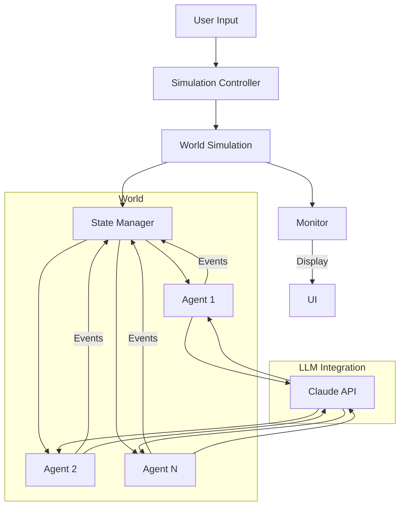
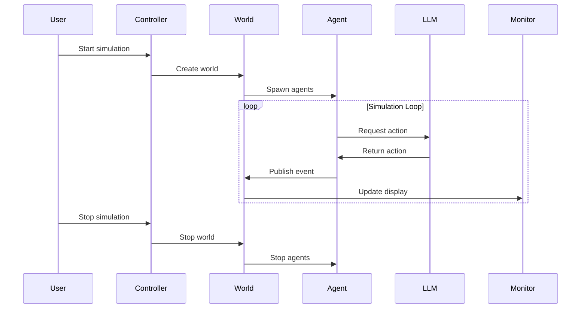
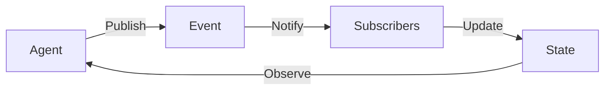

# WorldMorph: A Multi-Agent Simulation Framework

A flexible framework for creating and running multi-agent simulations with natural language interactions. Built with Python and Claude.

## System Architecture



## Key Components

### Core Classes
- **SimulationController**: Manages simulation creation and lifecycle
- **WorldSimulation**: Handles agent creation and coordination
- **Agent**: Individual actors with autonomous behavior
- **StateManager**: Manages shared state and event propagation
- **Monitor**: Real-time visualization of simulation state

### State Flow


## Getting Started

### Prerequisites
```bash
python 3.11+
pip install -r requirements.txt
```

### Environment Setup
Create a `.env` file in the project root:
```env
ANTHROPIC_API_KEY=your_api_key_here
```

### Running a Simulation
```bash
python examples/run_configured_simulation.py
```

## Simulation Types

The framework comes with three pre-configured simulation types:

1. **Organizational Simulation**
   - Simulates company dynamics
   - Multiple roles and hierarchies
   - Team interactions and workflows

2. **Economic Policy Simulation**
   - Models economic systems
   - Policy impacts and market responses
   - Multiple stakeholder interactions

3. **Urban Development Simulation**
   - City planning and growth
   - Infrastructure development
   - Population dynamics

## Custom Simulations

Create your own simulation by defining:
1. World parameters
2. Agent types and properties
3. Interaction rules
4. Environmental factors

Example:
```python
world_description = """
# Custom World Parameters
- Population: 1000
- Environment: Virtual marketplace
- Time Scale: 1 tick = 1 hour

# Agent Types
- Buyers
  - Goals: Find best deals
  - Budget: $100-1000
- Sellers
  - Goals: Maximize profit
  - Inventory: 10-100 items
"""

config = await SimulationConfig.from_prompt(world_description)
```

## Real-time Monitoring

The simulation provides real-time monitoring through a dual-panel interface:

```
┌─────────── Events Log ───────────┐
│ Time  │ Source │ Type  │ Action  │
│ 10:00 │ Agent1 │ MOVE  │ ...     │
│ 10:01 │ Agent2 │ SPEAK │ ...     │
└───────────────────────────────────┘
┌─────────── Agent Status ─────────┐
│ ID    │ Name  │ Status│ Action   │
│ AGT_1 │ Buyer │ Active│ Shopping │
│ AGT_2 │ Seller│ Active│ Trading  │
└───────────────────────────────────┘
```

## State Management

States are managed through events and subscriptions:



## Development

### Project Structure
```
multi_sim/
├── src/
│   ├── agent.py         # Agent implementation
│   ├── controller.py    # Simulation controller
│   ├── monitor.py       # UI and monitoring
│   ├── world.py         # World simulation
│   └── state/           # State management
├── examples/            # Example simulations
└── tests/              # Test suite
```

### Adding New Features
1. **New Agent Types**
   ```python
   class CustomAgent(Agent):
       async def decide_action(self) -> Dict[str, Any]:
           # Custom decision logic
   ```

2. **Custom State Handlers**
   ```python
   class CustomState(WorldState):
       async def handle_event(self, event: Event):
           # Custom event handling
   ```

### Testing
```bash
python -m pytest tests/
```

## Contributing

1. Fork the repository
2. Create a feature branch
3. Make your changes
4. Submit a pull request